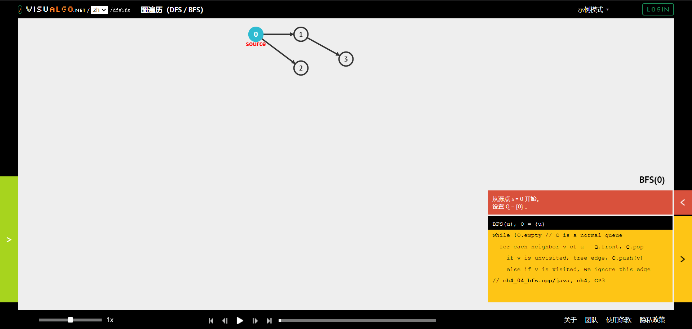
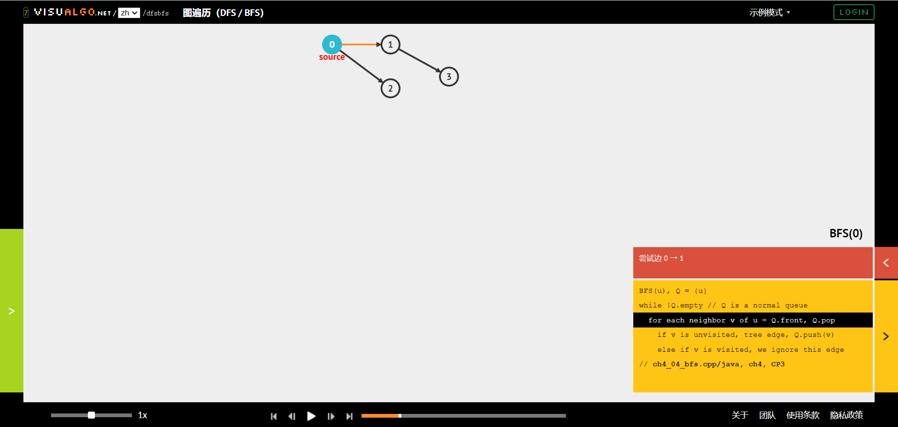
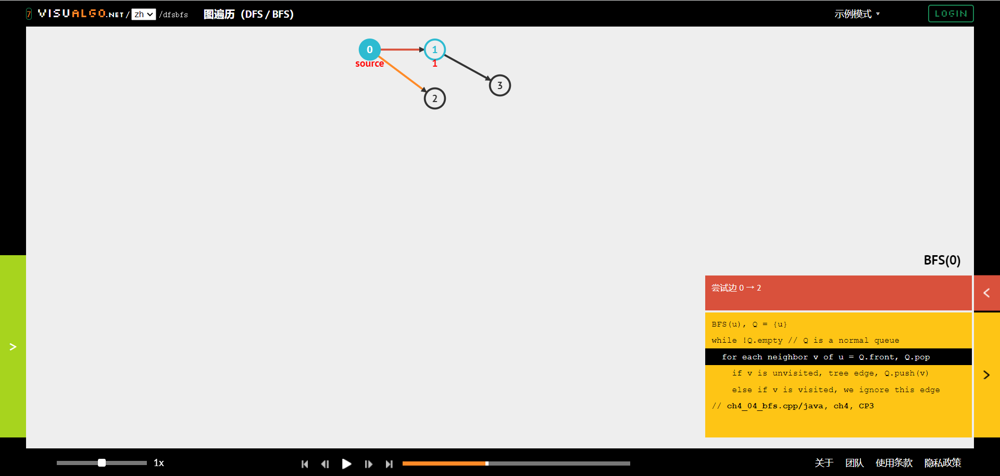
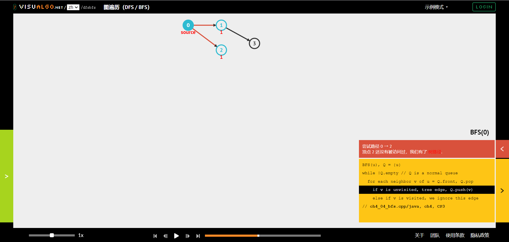
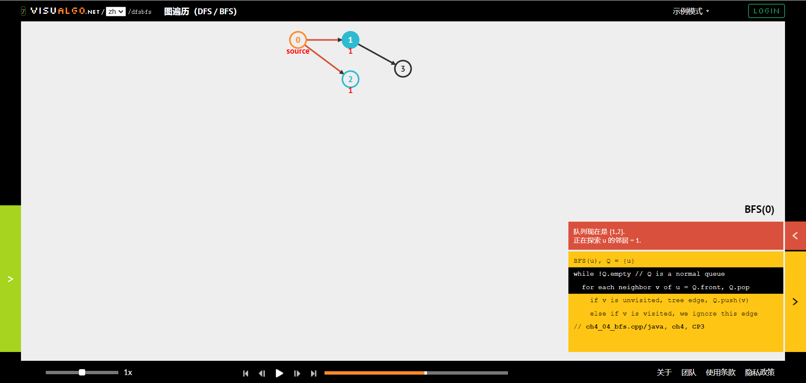
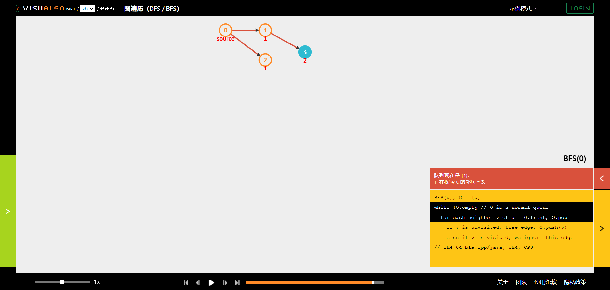

# jyyslide-md

<hr>

>[zweix](https://github.com/zweix123)

---

# 让我们试试不一样的交互方式

<hr>

>试试方向键  
>或者vim的`hjkl`  
>或者滑动屏幕(移动端)  

----

## 基于Reveal.js框架的Web幻灯片交互方式

+ 通过方向键或者`hjkl`切换幻灯片
+ 幻灯片维度更高，除了水平幻灯片还有竖直幻灯片
+ 其他快捷键：
    + `o`或`esc`：总览
    + `b`或者`v`：息屏、亮屏
    + `f`：全屏（`esc`退出全屏）

---

# 发心

----

## PowerPoint

> 可以从奥卡姆剃刀的角度考虑

能量点的功能非常丰富，但是功能多意味着学习成本大，但实际上我只需要很小部分的功能就能完成大部分的事情。  
由于这种复杂性，我们在借鉴别人的PPT模板时也由于对PPT本身不熟悉而不能发挥模板的全部效果

----

## 基于Web的幻灯片

|             框架             |             说明              |
| :--------------------------: | :---------------------------: |
|          Reveal.js           |        功能多，难度大         |
|          revael-md           | Reveal.js的前端，定制主题困难 |
|            Slidev            | 完备的软件，不支持垂直幻灯片  |
| VSCode插件、Obsidian默认插件 |            功能少             |

<hr>

并没有完全满足我的要求的框架

----

## [南京大学蒋炎岩老师幻灯片](http://jyywiki.cn/OS/2022/slides/1.slides#/)

蒋老师的幻灯片就很有意思，源码可以直接看，从代码上看大概也是使用了Reveal.js，但是自己定制了主题。  
在得到蒋老师的同意后，我通过类比老师的HTML源码开发出了这个将Markdown扩展语法转换成蒋老师幻灯片风格的工具。

---

# 扩展语法的介绍
>解析不是编译过程，  
>而且简单的split，  
>所以关键字不能用于正文

----

## 作者信息

我们观察蒋老师幻灯片的这部分

文字和图片对应且都是外链，想通过Markdown扩展语法实现会破坏语法的简约，所以我选择在Markdown的开头设置文件信息。

+ 使用标记`\n+++++\n`和正文分割，其格式使用Json，

[这个样例](https://github.com/zweix123/jyyslide-md/blob/master/example/jyy/%E6%93%8D%E4%BD%9C%E7%B3%BB%E7%BB%9F%E6%A6%82%E8%BF%B0.md)就是上图效果。

----

## 水平幻灯片和垂直幻灯片

您已经体验过水平和垂直的幻灯片

+ 使用`\n---\n`（三个减号的单独行）来划分水平幻灯片
+ 使用`\n----\n`（四个减号的单独行）来幻灯水平幻灯片

>更多的减号就是Markdwon的分隔符`<hr>`
>>`<hr>`在幻灯片中的渲染不是分隔符而是空行

----

# 渐变幻灯片

>下面展示一下典型应用

----



<hr>

>每张渐变幻灯片的格式规则和普通幻灯片是一样的

++++


<hr>

+ 使用关键字`\n++++\n`来划分

++++



<hr>

这里展示了渐变幻灯片的典型应用：展示变化的过程

++++


<hr>

它不会像默认的主题那样使用切换的方式而突兀

++++



<hr>

上面展示的就是广度优先搜索的过程

++++



这是最后倒数第七张

++++



这是最后倒数第六张

++++


这是最后倒数第五张

++++


这是最后倒数第四张

++++


这是最后倒数第三张

++++



这是最后倒数第二张

++++


这是最后一张

----

## 每张幻灯片依次出现的部分

--

+ 本质是Reveal.js的[fragments](https://revealjs.com/fragments/)

--

+ 使用关键字`\n--\n`划分

--

    它划分的是从标记一下到下一个标记或者当前幻灯片末尾的部分

---

# 对Markdown原生语法的适配

----

## 文本格式

+ 通过Markdown原生语法支持**加粗**和*斜体*
```
+ 通过Markdown原生语法支持**加粗**和*斜体*
```
+ 通过插入HTML支持<del>删除线</del>、<mark>高亮</mark>和<red>标红</red>
```
+ 通过插入HTML支持<del>删除线</del>、<mark>高亮</mark>和<red>标红</red>
```
+ Markdown语法：`大于三个-的行`  
    在Markdown这语法是分割线`<hr>`，但是和我定义的扩展语法冲突，所以这里是大于四个的`-`才是，另外对转换后的`<hr>`，作用是空行而不是分割线。

----

## 注释

>这是注释

----

## 列表

+ 这是无序列表
+ 这是无序列表
+ 这是无序列表

<hr>

1. 这是有序列表
2. 这是有序列表
3. 这是有序列表

<hr>

+ 这是嵌套列表
    1. 1
    2. 2
    3. 3

----

## 代码高亮

```c++
#include <iostream>

int main() {
    std::cout << "Hello World!" << std::endl;

    return 0;
}
```

>Reveal-md和Slidev支持的代码特定行高亮暂时不支持

----

## 数学公式

$$\overbrace{1+2+\cdots+n}^{n个} \qquad \underbrace{a+b+\cdots+z}_{26}$$
```
$$\overbrace{1+2+\cdots+n}^{n个} \qquad \underbrace{a+b+\cdots+z}_{26}$$
```

<hr>

$$\lim_{x \to \infty} x^2_{22} - \int_{1}^{5}x\mathrm{d}x + \sum_{n=1}^{20} n^{2} = \prod_{j=1}^{3} y_{j}  + \lim_{x \to -2} \frac{x-2}{x}$$
```
$$\lim_{x \to \infty} x^2_{22} - \int_{1}^{5}x\mathrm{d}x + \sum_{n=1}^{20} n^{2} = \prod_{j=1}^{3} y_{j}  + \lim_{x \to -2} \frac{x-2}{x}$$
```
----

## 引用：普通引用

[分布式存储系统Curve](https://github.com/opencurve/curve)

```
[分布式存储系统Curve](https://github.com/opencurve/curve)
```


----

## 引用：图片
>支持Markdown原生图片引用语法：  
>```
>
>```


建议使用插入HTML的方式
```html

```
这里`alt`并不是必须的


----

## 图片格式

+ 图片居中
```html

```

>顺序不关键

+ 右对齐
```html

```

>Markdown是流的形式，即图片是占位的，但是这里右对齐的图片不占位

+ 大小

```html

```

----

## 其他

+ 关于自定义（需要前端知识）

>自定义在本框架中是不推荐的，因为“像蒋炎岩”是项目的第一目的，其他的是次要，比如您需要自定义，要么您需要重构您的幻灯片，要么这个框架不适合您。

蒋老师的主题样式都在静态文件下`jyy/jyy.css`文件中，网页的主体都在`.reveal .slides`下，在这里修改即可全局修改（推荐只修改诸如字体、字间距、行间距这样的属性，zweix的前端也不好，不知道其他修改会发生什么）


---

# 谢谢

>希望本工具能提高您的效率