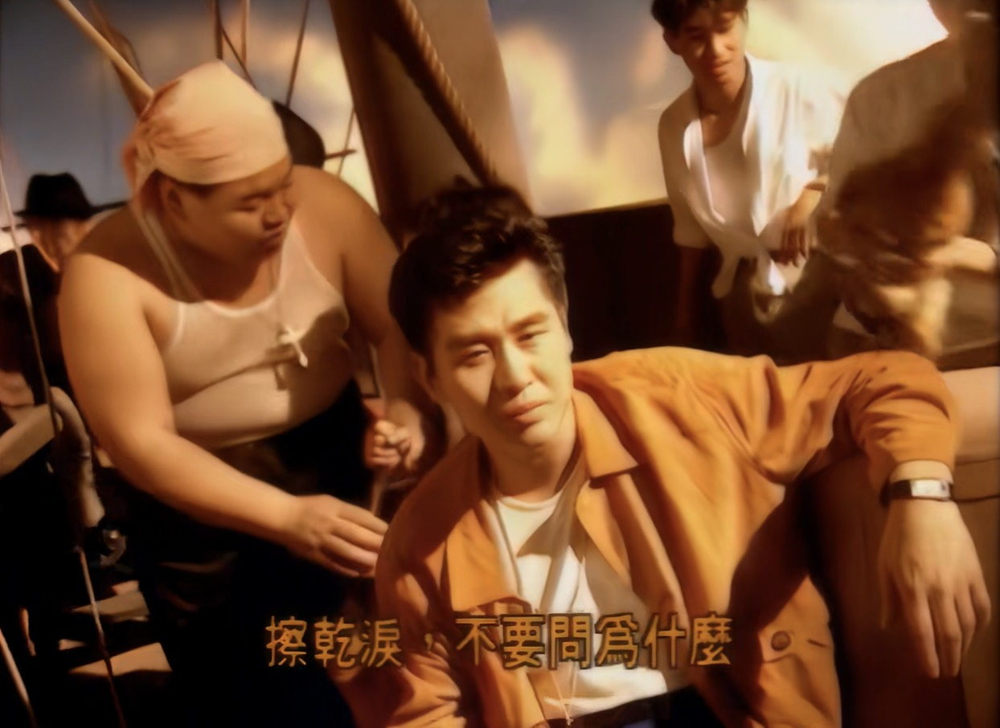
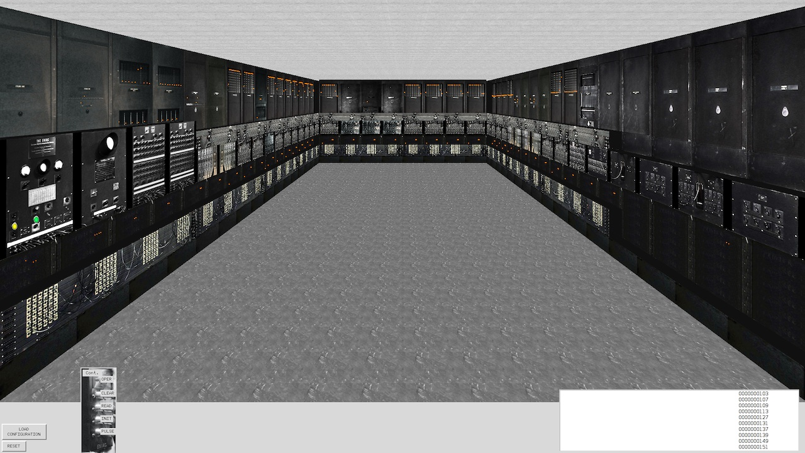
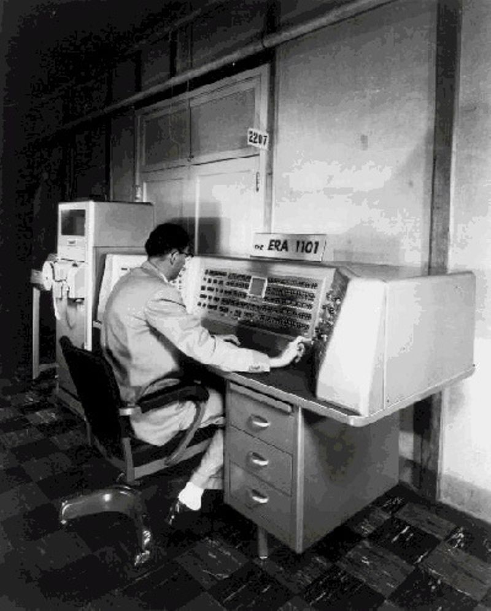

  author:
    name: 蒋炎岩
    url: https://ics.nju.edu.cn/~jyy/

  departments:
    - name: "  南京大学  "
      url: https://www.nju.edu.cn/main.htm,
      img: ./img/nju-logo.jpg

    - name: 计算机科学与技术系
      url: https://cs.nju.edu.cn/main.htm,
      img: ./img/njucs-logo.jpg

    - name: 计算机软件研究所
      url: https://www.nju.edu.cn/main.htm,
      img: ./img/ics-logo.png
+++++

# 操作系统概述

----

## Overview
本次课回答的问题

+ **Q1** (Why): 为什么要学操作系统？
+ **Q2** (What): 到底什么是操作系统？
+ **Q3** (How): 怎么学操作系统？

<hr>

本次课主要内容

+ 前导知识概述
+ 操作系统的历史/宏观概述

---

# 个人/课程简介

----

## 我是谁？


<del>努力成为卷王的临时工✖️</del> ([计算机软件研究所](https://cs.nju.edu.cn/ics/index.htm)✔)

+ “软件自动化”：测试/分析；代码合成
+ Two ACM SIGSOFT Distinguished Paper  
    Awards; Best Paper Award @ ICSE'21

<hr>
  
Co-Founder of Project-N

+ 在 bare-metal 上实现完整计算机系统

<hr>

JSOI/<del>南京大学 ICPC 集训队</del>教练

+ CCF NOI/NOIP 系列赛江苏赛区技术负责人
+ ICPC World Finals 49th Place (2009, team leader)
+ ICPC World Finals 13th Place (2019, co-coach)

----

## 课程信息与成绩构成

>所有课程信息都在[课程主页](http://jyywiki.cn/OS/2022/)发布 (请 RTFM)！

成绩构成

+ 期末考试 40% + 随堂期中测验 10%
+ 大实验 25% + 小实验 25%
    + soft + hard deadlines
        + <red>不要对编程抱有任何侥幸心理</red>
        + 无论你基础如何，都相信自己能做到

<hr>

不强制要求到课

+ 努力上传视频，但不保证设备不会翻车

----

## 学术诚信 (Academic Integrity)
[Academic integrity](https://integrity.mit.edu/) 不是底线，而是 “自发的要求”

+ 对 “不应该做的事情” 有清楚的认识
    + **<red>不将代码上传到互联网</red>**
    + **<red>主动不参考别人完成的实验代码</red>**
    + **<red>不使用他人测试用例</red>** (depends)
+ 有些行为可能使你**得到分数**，但**失去应有的训练**

<hr>

只在 “绝对可以求助” 的时候才寻求帮助

+ 在全民内卷、不劳而获很容易的时代很难
+ 但坚持下来的人会变得很不一样

----

## 四周目反思

四周目表现平稳

+ 增加了更多的代码课和代码示例
    + 非递归汉诺塔
    + `.dl` 二进制文件格式与动态加载器
    + model checker (本周目将得到大幅改进)

<hr>

第五周目

+ 工具现代化 + 新手友好
    + 绝大部分代码示例都在 Windows 应用商店安装的 Ubuntu
+ 更多的 xv6 (大家有 RISC-V 的基础了)
+ 逐渐重构 Online Judge
+ 更新一部分实验 (如果可以的话，有一个 POSIX subsystem)

---

# Q1: 为什么要学操作系统？

----

## 为什么要学操作系统？



为什么要学操作系统呢？

+ 为什么要学微积分/离散数学/XXXX/……？
+ 长辈/学长：<del>擦干泪不要问为什么</del>

<hr>

微积分 “被混起来” 的几件事

+ Newton 时代的微积分 (启蒙与应用)
    + 现代方法：Mathematica, [sympy](https://docs.sympy.org/latest/tutorial/index.html), [sage](http://sagemath.org/)
        + 这也是为什么我主张第一门语言学 Python
+ Cauchy 时代的微积分 (严格化与公理化)
    + 以及之后各种卡出的 bug (Weierstrass 函数、Peano 曲线……)
+ 微积分的现代应用
    + 优化、有限元、PID……


----

## 学习操作系统的目的

<red>你体内的 “编程力量” 尚未完全觉醒</red>

+ 每天都在用的东西，你还没搞明白
    + 窗口是怎么创建的？[为什么 Ctrl-C 有时不能退出程序？](https://stackoverflow.blog/2017/05/23/stack-overflow-helping-one-million-developers-exit-vim/)
+ 组里的服务器有 128 个处理器，但你的程序却只能用一个 😂
+ 你每天都在用的东西，你却实现不出来
    + 浏览器、编译器、IDE、游戏/外挂、任务管理器、杀毒软件、病毒……

<hr>

<red>《操作系统》给你有关 “编程” 的全部</red>

+ 悟性好：学完课程就在系统方向 “毕业”
    + 具有编写一切 “能写出来” 程序的能力 (具备阅读论文的能力)
+ 悟性差：内力大增
    + 可能工作中的某一天想起上课提及的内容

----

## 学习操作系统的目的

>充满热情而且相当聪明的学生...早就听说过物理学如何有趣...相对论、量子力学……但是，当他们学完两年以前那种课程后，许多人就泄气了……学的还是斜面、静电这样的内容
>
>——《The Feynman Lectures on Physics, 1963》

我学《操作系统》的时候 (2009)，大家都说操作系统很难教

+ 使用<del>豆瓣评分高达 5.7/10</del> 的 “全国优秀教材”
    + 没有正经的实验 (写一些 16-bit code)
    + 完全错误的 toolchain，调试全靠蛮力和猜
    + 为了一点微不足道的分数内卷、沾沾自喜、失去 integrity
+ 这么玩，<red>脖子都要被美国人掐断了</red>
    + 这门课的另一个意义：<red>告诉你可以去变得更强、真正的强</red>

---

# Q2: 到底什么是操作系统？

----

## 什么是操作系统？

>Operating System: A body of software, in fact, that is responsible for *making it easy to run programs* (even allowing you to seemingly run many at the same time), allowing programs to share memory, enabling programs to interact with devices, and other fun stuff like that. (OSTEP)

<hr>

--

很多疑点

+ “programs” 就完了？那么多复杂的程序呢！
+ “shared memory, interact with devices, ...”？

----


## 什么是操作系统？ (cont'd)

“管理软/硬件资源、为程序提供服务” 的程序？


----

## 理解操作系统

“精准” 的定义毫无意义

+ 问出正确的问题：操作系统如何从一开始变成现在这样的？
+ 三个重要的线索
    + 计算机 (硬件)
    + 程序 (软件)
    + 操作系统 (管理软件的软件)

<hr>

本课程讨论<red>狭义的操作系统</red>

+ 对单一计算机硬件系统作出抽象、支撑程序执行的软件系统
+ 学术界谈论 “操作系统” 是更广义的 “System” (例子：OSDI/SOSP)

----

## 1940s 的计算机

跨时代、非凡的天才设计，但很简单 (还不如我们数电实验课做的 CPU 复杂呢)：

+ 计算机系统 = 状态机 (ICS 课程的 takeaway message)
+ 标准的 Mealy 型数字电路
    + ENIAC (1946.2.14；请在这个特殊的节日多陪陪你的电脑)



----

## 1940s 的计算机 (cont'd)

电子计算机的实现

+ 逻辑门：[真空电子管](https://www.bilibili.com/video/av59005720/?vd_source=4ee99d4ebd507c7277fa312ed28dbdda)
+ 存储器：延迟线 (delay lines)
+ 输入/输出：打孔纸带/指示灯


<center>


</center>

----

## 1940s 的程序

ENIAC 程序是用物理线路 “hard-wire” 的

+ 重编程需要重新接线
    + [ENIAC Simulator; sieve.e](https://www.cs.drexel.edu/~bls96/eniac/)

<hr>

最早成功运行的一系列程序：打印平方数、素数表、计算弹道……

+ 大家还在和真正的 “bugs” 战斗


----

## 1940s 的操作系统

>没有操作系统。

能把程序放上去就很了不起了

+ 程序直接用指令操作硬件
+ 不需要画蛇添足的程序来管理它

----

## 1950s 的计算机
更快更小的逻辑门 (晶体管)、更大的内存 (磁芯)、丰富的 I/O 设备

+ I/O 设备的速度已经严重低于处理器的速度，中断机制出现 (1953)




----

## 1950s 的程序

可以执行更复杂的任务，包括通用的计算任务

+ 希望使用计算机的人越来越多；希望调用 API 而不是直接访问设备
+ Fortran 诞生 (1957)

```
C---- THIS PROGRAM READS INPUT FROM THE CARD READER,
C---- 3 INTEGERS IN EACH CARD, CALCULATE AND OUTPUT
C---- THE SUM OF THEM.
  100 READ(5,10) I1, I2, I3
   10 FORMAT(3I5)
      IF (I1.EQ.0 .AND. I2.EQ.0 .AND. I3.EQ.0) GOTO 200
      ISUM = I1 + I2 + I3
      WRITE(6,20) I1, I2, I3, ISUM
   20 FORMAT(7HSUM OF , I5, 2H, , I5, 5H AND , I5,
     *   4H IS , I6)
      GOTO 100
  200 STOP
      END
```

----

# 省略

---

# 省略